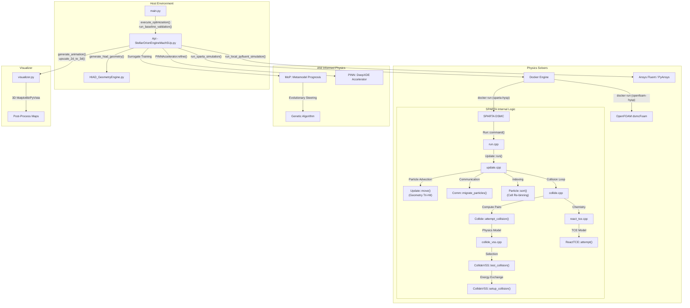
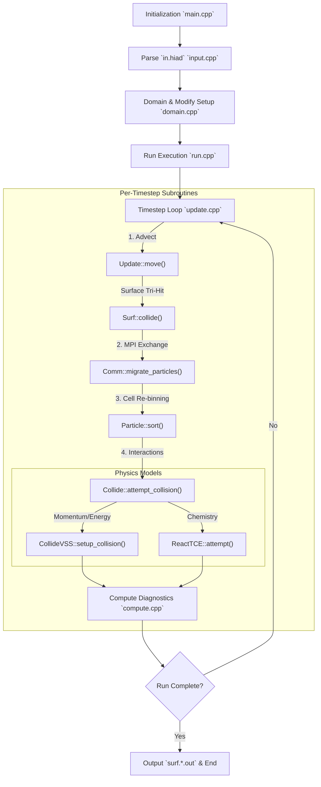

# StellarOrion Hypersonic Edition: Exhaustive Architecture & Component Logic

This document provides a deep-dive into the technical core of StellarOrion, documenting every component interaction from `main.py` to the **Artificial Narrow Intelligence (ANI) Informed Physics** backends.

---

## 1. Global Component Interaction Map



---

## 2. Component: DeepXDE PINN Accelerator (ANI Informed Physics)
**Module:** `source/pinn_accelerator.py`  
**Role:** Refines noisy DSMC particle data by enforcing conservation laws (Euler Equations) using Artificial Narrow Intelligence (ANI).

### 2.1 Physics Residuals (Euler 2D Axisymmetric)
The ANI model minimizes the residual $R$ of the following equations:
1.  **Continuity:** $\frac{\partial (\rho u)}{\partial x} + \frac{\partial (\rho v)}{\partial y} + \frac{\rho v}{y} = 0$
2.  **X-Momentum:** $\rho(u u_x + v u_y) + p_x = 0$
3.  **Y-Momentum:** $\rho(u v_x + v v_y) + p_y = 0$
4.  **Equation of State:** $p - \rho R T = 0$

### 2.2 Default PINN Variables & Hyperparameters
| Variable | Default Value | Note |
| :--- | :--- | :--- |
| `DDE_BACKEND` | `"pytorch"` | Internal DL backend |
| `net` layers | `[2] + [128]*5 + [5]` | Input(2), Hidden(128x5), Output(5) |
| `activation` | `"tanh"` | Standard for PINN gradients |
| `optimizer` | `"adam"` | First-order optimizer |
| `lr` | `1e-3` | Initial learning rate |
| `iterations` | `1500` | Default training steps |
| `num_domain` | `2500` | Random points in fluid domain |
| `num_boundary` | `500` | Points on surface/inflow |
| `anchors` | `5000` | Max DSMC points used for training |

---

## 3. Component: MoP SBO Optimization (ANI Steering)
**Module:** `StellarOrionEngineMach5Up.py` (`execute_optimization` subroutine)  
**Role:** Global optimization using a Metamodel (MoP) and Genetic Algorithm (GA) powered by ANI.

### 3.1 Metamodel (MoP) Architecture
An ANI-based PyTorch neural network that maps geometric parameters $X_{geo}$ to flight metrics $Y_{metrics}$.
- **Input ($X_{geo}$):** `[diameter, angle, toroids, nose, ...]`
- **Output ($Y_{metrics}$):** `[goal_val, beta, stag_heat, heat_load, time_of_peak, g_load, stag_press, backface_temp]`

**Model Hyperparameters (Default):**
- **Hidden Layers:** `nn.Linear(n_dim, 128) -> ReLU -> nn.Linear(128, 128) -> ReLU -> nn.Linear(128, n_out)`
- **Optimizer:** `Adam(lr=0.005)`
- **Training Epochs:** `500` (or until Loss < `1e-6`)

### 3.2 Evolutionary GA Steering (ANI MoP Loop)
The ANI GA "flies" through the metamodel to find the global optimum configuration.

**Logic Flow:**
1. **Initialize Population:** Generate random configurations in the search space.
2. **Evaluation:** Use the ANI MoP model to **predict** the performance of $20,000+$ candidates.
3. **Constraint Layer (Methodology of Physics):**
    - **Thermal:** If $T_{backface} > 350.0\text{ K}$, add penalty $10^{15}$.
    - **Structural:** If $Peak\_G > 25.0\text{ g}$, add penalty $10^{15}$.
    - **Aero:** Calculate $\beta$ penalty relative to `target_beta` (Default: `150`).
4. **Convergence:** Terminate if `min_total_cost` stagnates for `5` checks (every 1000 generations).

---

## HIAD Geometry Engine (MDAO Alignment)
The geometry engine has been refactored to align with the **"MDAO of Inflatable Stacked Toroids"** (Rapisarda, 2023) analytical framework. This ensures that the generated CAD models are mathematically consistent with flight-proven architectures (IRVE, LOFTID).

### 1. Geometric Conventions
*   **Angle Definition:** The half-cone angle $\theta_c$ is measured from the **vertical axis of symmetry**. 
*   **Blunt Body Tangency:** The spherical nose radius $r_N$ is calculated to ensure a perfectly tangent transition to the conical shell exactly at the payload radius $r_{pay}$ (MDAO Eq 3.4):
    $$r_N = \frac{r_{pay}}{\cos(\theta_c)}$$
*   **Payload Positioning:** The payload is modeled as a square/rectangular centerbody situated at the nose axis ($Z=0$), extending upward ($+Z$) into the concave aftbody/wake region of the HIAD shield. This perfectly matches the physical layout of the IRVE-3 baseline where inflatable rings wrap outward around the central payload.
*   **Toroid Packing:** Toroids are stacked along the cone slant with the first torus center offset by $r_t$ from the tangency point.

### 2. Validation Case: IRVE-3
The engine was validated against the IRVE-3 flight vehicle parameters from the MDAO literature (Table 4.1):
*   **Inputs:** $\theta_c = 60^\circ$, $N = 6$, $r_t = 0.135$m, $r_{sh} = 0.0508$m, $r_{pay} = 0.275$m.
*   **Analytical Result (Eq 3.3):** Calculated Inflated Radius $r_{inflated} \approx 1.802$ m.
*   **CAD Output:** Successfully generated a watertight surface of revolution matching the analytical profile.


*Figure: IRVE-3 Cross-section validation showing nose tangency and toroid packing alignment.*

### 3. Integrated Components
*   **Shoulder Torus ($N+1$):** Support for recent HIAD designs using a smaller-diameter outer torus to stabilize the aerodynamic skin.
*   **Scalloped Aerodynamic Skin:** Spline-based skin generation that captures the unique "scalloped" topology of inflated toroids, critical for high-fidelity DSMC/CFD simulations.
| `--angle` | `60.0` | Forebody half-cone angle [deg] |
| `--nose` | `0.191` | Nose stagnation radius [m] |
| `--toroids` | `7` | Number of inflatable structural rings |
| `--thickness` | `0.0254` | F-TPS layer thickness [m] |
| `--slice_angle`| `360.0` | Revolve angle for 3D/Axisymmetric |

---

## 4. Component: Geometry Kernel (CAD)
**Module:** `CADDesign/HIAD_GeometryEngine.py`  
**Role:** Generates the parametric STL/SURF files for the physics solvers.

### 4.1 Default Geometric Variables
| Variable | Default Value | Note |
| :--- | :--- | :--- |
| `--diameter` | `3.0` | Major outer diameter [m] |
| `--angle` | `60.0` | Forebody half-cone angle [deg] |
| `--nose` | `0.191` | Nose stagnation radius [m] |
| `--toroids` | `7` | Number of inflatable structural rings |
| `--thickness` | `0.0254` | F-TPS layer thickness [m] |
| `--slice_angle`| `360.0` | Revolve angle for 3D/Axisymmetric |

---

## 5. Main Initialization Branching (`main.py`)

### 5.1 Environment Bootstrap Logic
```python
if "IN_DOCKER" not in os.environ:
    # --- IF/ELSE logic for Host Environment ---
    if not venv_python or sys.executable != venv_python:
        # Create .venv_gui
        # pip install requirements.txt
        # os.execv(restart)
    
    # --- Integrity Check Logic ---
    if "--skip-diag" not in sys.argv:
        # Check pyrefly, DeepXDE, Docker Service
        # IF Critical Error: sys.exit(1)
```

---

## 6. Physics Solver Interfacing

### 6.1 SPARTA (DSMC) Subroutine logic
- **Physical Foundation:** Solves the **Boltzmann Equation** for rarefied gas dynamics using the **Direct Simulation Monte Carlo (DSMC)** method (Bird, 1994).
    - **Boltzmann Equation:** $\frac{\partial f}{\partial t} + \mathbf{v} \cdot \nabla f + \frac{\mathbf{F}}{m} \cdot \nabla_{\mathbf{v}} f = \left( \frac{\partial f}{\partial t} \right)_{coll}$
    - **Logic:** Particle simulation is used where the Knudsen number ($Kn > 0.01$) invalidates continuum-based Navier-Stokes assumptions.
- **Initialization:** Copy `air.species`, `air.vss`, `air.react`.
- **Scripting:** Dynamically write `in.hiad` with `opt_params`.
- **Hardware Selection:**
    - **If `SPARTA_GPU == 1`:** Use `-sf kk` flag for Kokkos CUDA/OpenMP.
    - **Else:** Standard MPI/Threaded CPU.
- **Parsing:** Scan `surf.*.out` for `fx` (Drag) and `ke` (Heat).

#### 6.1.1 The Role of the Computational Grid in DSMC
While DSMC is a particle-based method, the program (SPARTA/OpenFOAM) requires a grid for three fundamental physical and computational reasons:

1.  **Collision Pairing Efficiency ($O(N)$ vs $O(N^2)$):** 
    Without a grid, the solver would need to check every particle against every other particle for potential collisions, leading to a computational complexity of $O(N^2)$. The grid discretizes the domain into cells; collision pairs are only selected from particles within the same cell, reducing complexity to $O(N)$.
2.  **Macroscopic Property Sampling:** 
    DSMC is a stochastic simulation. To derive deterministic engineering metrics (e.g., Density $\rho$, Temperature $T$, Pressure $P$), the properties of individual particles must be averaged over time within a defined spatial volume. The grid cells serve as these "sampling buckets" for statistical accumulation.
3.  **Physical Localization (Mean Free Path Consistency):** 
    For the simulation to remain physically valid, the grid resolution must be finer than the **local mean free path** ($\lambda$). If a cell is too large, particles may non-physically skip over interaction regions (like shock waves) without colliding, leading to a "design mismatch" where gradients are smeared and physics is lost.

#### SPARTA Internal Logic Flowchart



#### SPARTA API Interface (`StellarOrionEngineMach5Up.py`)
The `Api` class manages the execution, environment generation, and data extraction for the SPARTA DSMC solver. Key subroutines include:
- `build_sparta_image()`: Compiles the SPARTA Kokkos/MPI Docker container if not present.
- `test_sparta_readiness()`: Validates Docker daemon and image availability.
- `get_chemistry_data(opt_params)`: Retrieves planetary atmospheric species (`.species`), variable soft sphere collision definitions (`.vss`), and TCE reaction rates (`.tce`).
- `generate_surf_react_script(opt_params)`: Dynamically generates the catalytic surface recombination script for the chosen planetary environment.
- `generate_sparta_script(opt_params, **kwargs)`: Constructs the `in.hiad` input script, setting the simulation domain, fluid properties, and grid resolution.
- `run_sparta_simulation(...)`: Core execution loop. Executes `docker run sparta-hysp` and tails the log output.
- `parse_sparta_results()`: Scans the solver outputs (`surf.*.out`) to compute total aerodynamic Drag ($F_x$) and peak Stagnation Heat Flux ($k_e$), and extracts $T_{shock}$ from `grid.*.out`.
- `calculate_flight_metrics(sparta_res, opt_params, sample_dict)`: Translates raw DSMC outputs into mission-critical metrics using the following physical derivations:
    - **Freestream Density:** $\rho_{\infty} = n_{rho} \cdot \frac{M_{air}}{N_A} \quad \text{where } M_{air} = 28.97 \text{ g/mol}$
    - **Dynamic Pressure:** $q = \frac{1}{2} \rho_{\infty} V_{\infty}^2$
    - **Ballistic Coefficient:** $\beta = \frac{m \cdot q}{F_{drag}}$
    - **Knudsen Number:** $\lambda = \frac{1}{\sqrt{2} \pi d_{mol}^2 n_{rho}} \implies Kn = \frac{\lambda}{D_{HIAD}}$
    - **G-Load:** $G = \frac{F_{drag}}{m \cdot g_0} \quad \text{where } g_0 = 9.81 \text{ m/s}^2$
    - **Radiative Equilibrium Surface Temp:** $T_{surface} = \left(\frac{\dot{q}_{stag}}{\sigma \epsilon}\right)^{0.25}$
    - **1D Transient Backface Temp:** 
      1. $Q_{load} = \dot{q}_{stag} \cdot t_{duration}$
      2. $\Delta T = \frac{Q_{load} \cdot \eta_{lag}}{\rho_{tps} C_{p,tps} t_{tps}} \quad \text{(where } \eta_{lag} \text{ is thermal penetration fraction)}$
      3. $T_{backface} = T_{init} + \Delta T$
    - **Survivability Envelope:** Cross-references $T_{surface}$, $T_{backface}$, and $G$ against TPS material limits (e.g., SiC $1870$K, $350$K bondline) and payload structural constraints ($<25$g).

### 6.2 OpenFOAM (dsmcFoam) Logic
- **Case Setup:** Uses `CADDesign/openfoam_case` template.
- **Execution:** 
    1. `surfaceFeatureExtract`
    2. `blockMesh`
    3. `snappyHexMesh`
    4. `dsmcInitialise`
    5. `dsmcFoam`
- **Output:** Extract `.vtk` data from `postProcessing` directory.

---

## 7. Technical Stack: ANI Informed Physics

| Tier | Component | Technology | Role |
| :--- | :--- | :--- | :--- |
| **Foundational** | Physics Backend | SPARTA (DSMC) / OpenFOAM | Ground-truth data generation |
| **Intelligence** | **ANI Informed Physics** | DeepXDE / PyTorch | Residual-based PDE refinement & Metamodeling |
| **Optimization** | **Evolutionary ANI** | Genetic Algorithm / LHS | Multi-objective design steering |
| **Hardware** | Acceleration | CUDA / MPS / Kokkos | Near-real-time training & inference |
