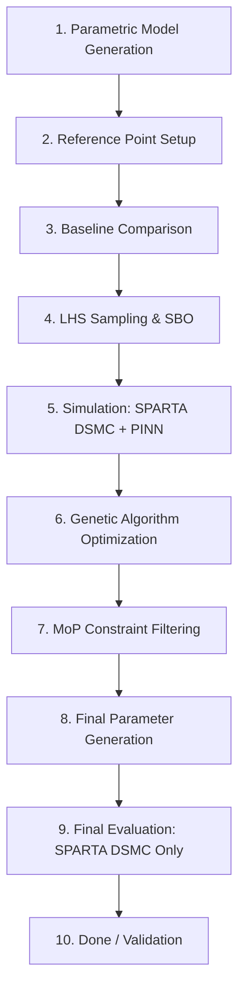

# Scientific Methodology: StellarOrion Hypersonic Optimization

This document outlines the end-to-end scientific workflow of the StellarOrion Hypersonic Edition, detailing the integration of DSMC solvers, Physics-Informed Neural Networks (PINNs), and Surrogate-Based Optimization (SBO).

## Workflow Overview

The optimization pipeline follows a multi-stage process to transition from a conceptual parametric model to a flight-validated optimal configuration.

---

### Phase 1: Pre-Processing & Calibration
1.  **Parametric Model Generation**: A 3D CAD model of the HIAD (Hypersonic Inflatable Aerodynamic Decelerator) is generated using specific parameters (toroid count, cone angle, nose radius).
2.  **Reference Point Setup**: The system is calibrated against established flight data, primarily the **IRVE-3 (3.0m)** and **LOFTID (6.0m)** mission results.
3.  **Baseline Comparison**: An initial "zero-run" is performed to verify that the solver baseline matches historical data (e.g., $C_D \approx 1.47$ for IRVE-3).

### Phase 2: Design Space Exploration (SBO)
4.  **LHS Sampling**: **Latin Hypercube Sampling (LHS)** is used to generate a distributed set of design points across the parameter space (e.g., varying mass, diameter, and TPS thickness).
5.  **Hybrid Simulation (SPARTA + PINN)**:
    *   **SPARTA (DSMC)**: Solves the Boltzmann equation for rarefied/transitional gas dynamics.
    *   **DeepXDE (PINN)**: A Physics-Informed Neural Network is used to refine the noisy DSMC data, fill gaps in the flow field, and accelerate the surrogate model's training.

### Phase 3: Global Optimization
6.  **Genetic Algorithm (GA)**: The "Parent" logic iterates through generations of designs, performing crossover and mutation to maximize the fitness function.
7.  **Methodology of Physics (MoP)**: A physics-informed constraint layer filters the GA results. It applies infinite penalties to designs that violate "hard" limits (e.g., $T_{backface} > 350K$ or $Peak\_G > 25g$).
8.  **Final Parameter Generation**: The optimizer converges on the "Global Optimum" configuration that balances drag, mass, and survivability.

### Phase 4: Validation
9.  **Final Evaluation (High-Fidelity)**: The final optimized parameters are fed back into **SPARTA (DSMC)** for a high-resolution validation run **without PINN refinement**. This ensures that the PINN's approximations haven't introduced non-physical artifacts.
10. **Done**: The validated design is exported as a finalized HIAD parametric model with associated aerothermal performance metrics.

---

## Solver Regimes & Selection Logic

| Stage | Solver Used | Rationale |
| :--- | :--- | :--- |
| **Exploration** | SBO / PINN | Ultra-fast estimation of 1000s of design candidates. |
| **Refinement** | DSMC + PINN | Bridges the gap between noisy particle data and continuous flow fields. |
| **Validation** | **DSMC Only** | Eliminates neural network bias; provides pure kinetic-regime ground truth. |
| **High-Mach (Future)** | **Ansys Fluent + PINN** | Hybrid approach: **Fluent** (Physics) + **DeepXDE** (GPU Refinement). |
| **Advanced Wake Modeling** | **FUN3D / HyperSolve** | Uses Finite-Volume methods (Roe/LDFSS) and DDES/LES for high-fidelity unsteady wake heating. |

> [!IMPORTANT]
> **Darwin/XNU (macOS) Resource Note:** To prevent system overload, executors on macOS must run **sequentially**. The Bridge dynamically manages VM lifecycle (Docker vs. Windows) and awaits completion of one phase before initializing the next.

---
## References
*   Cassell, G. J., "IRVE-3 Flight Results," *AIAA 2013-1386*.
*   Lu, L., "DeepXDE: A deep learning library for solving differential equations," *SIAM Review*, 2021.

---
## 8. Project Milestones
*   **April 22, 2026:** Finalization of Week 1 Progress Report and establishment of the baseline IRVE-3 simulation architecture.
