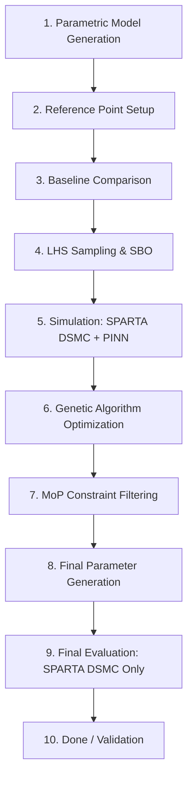

# Scientific Methodology: StellarOrion Hypersonic Optimization

This document outlines the end-to-end scientific workflow of the StellarOrion Hypersonic Edition, detailing the integration of DSMC solvers, Physics-Informed Neural Networks (PINNs), and Surrogate-Based Optimization (SBO).

## Workflow Overview

The optimization pipeline follows a multi-stage process to transition from a conceptual parametric model to a flight-validated optimal configuration.

---

### Phase 1: Pre-Processing & Calibration
1.  **Parametric Model Generation**: A 3D CAD model of the HIAD (Hypersonic Inflatable Aerodynamic Decelerator) is generated using specific parameters (toroid count, cone angle, nose radius).
2.  **Reference Point Setup**: The system is calibrated against established flight data, primarily the **IRVE-3 (3.0m)** (Lau et al., 2013) and **LOFTID (6.0m)** (Lippincott et al., 2019) mission results.
3.  **Baseline Comparison**: An initial "zero-run" is performed to verify that the solver baseline matches historical data (e.g., $C_D \approx 1.47$ for IRVE-3).

### Phase 2: Design Space Exploration (SBO)
4.  **LHS Sampling**: **Latin Hypercube Sampling (LHS)** is used to generate a distributed set of design points across the parameter space (e.g., varying mass, diameter, and TPS thickness).
5.  **Hybrid Simulation (SPARTA + PINN)**:
    *   **SPARTA (DSMC)**: Solves the Boltzmann equation for rarefied/transitional gas dynamics (Plimpton & Gallis, 2014).
    *   **DeepXDE (PINN)**: A Physics-Informed Neural Network is used to refine the noisy DSMC data, fill gaps in the flow field, and accelerate the surrogate model's training.

#### PINN Governing Equations
The DeepXDE PINN solves the 2D Compressible Navier-Stokes equations using automatic differentiation. The network $\mathcal{N}(x, y) \to (\rho, u, v, T, p)$ is trained to minimize the following PDE residuals:

**1. Continuity Equation (Axisymmetric):**
$$\frac{\partial (\rho u)}{\partial x} + \frac{\partial (\rho v)}{\partial y} + \frac{\rho v}{y} = 0$$

**2. X-Momentum:**
$$\rho\left(u\frac{\partial u}{\partial x} + v\frac{\partial u}{\partial y}\right) + \frac{\partial p}{\partial x} - \mu\nabla^2 u = 0$$

**3. Y-Momentum:**
$$\rho\left(u\frac{\partial v}{\partial x} + v\frac{\partial v}{\partial y}\right) + \frac{\partial p}{\partial y} - \mu\nabla^2 v = 0$$

**4. Energy Equation (Axisymmetric):**
$$\rho c_p\left(u\frac{\partial T}{\partial x} + v\frac{\partial T}{\partial y}\right) - k\nabla^2 T - u\frac{\partial p}{\partial x} - v\frac{\partial p}{\partial y} - \Phi = 0$$

**5. Equation of State:**
$$p - \rho R T = 0$$

The total loss function combines PDE residuals with observational data from SPARTA:
$$\mathcal{L}_{total} = \sum_{i=1}^{N_{PDE}} w_i \mathcal{L}_i^{PDE} + \sum_{j=1}^{N_{data}} w_j \mathcal{L}_j^{data}$$

Where $\mathcal{L}^{data}$ matches the PINN predictions against SPARTA grid checkpoints.

#### Why Compressible Navier-Stokes Instead of Lattice Boltzmann?

You asked: *"Why use compressible NS for pairing with DSMC when NS is a continuum model, not suitable for non-continuum/rarefied flow?"*

This is an intentional **pragmatic choice**, not a physical claim. Here's why:

**1. PINNs Require Differentiable PDEs**
Neural networks use backpropagation which requires smooth, differentiable equations. The Navier-Stokes (NS) equations are continuous and naturally differentiable via automatic differentiation. Lattice Boltzmann methods (LBM), by contrast, use discrete velocity distributions on a fixed lattice and lack the natural differentiability required for standard PINN implementations.

**2. Two-Stage Optimizer Architecture, Not Full CFD**
The system is designed as a **hybrid optimization pipeline**, not a standalone CFD solver:
*   **Stage 1 (SPARTA)**: Full kinetic theory via DSMC for rarefied flow physics
*   **Stage 2 (PINN)**: Uses NS equations as a "physics regularizer" to smooth noisy SPARTA outputs and interpolate gaps in the flow field

**3. Physics-Informed Prior, Not Physical Claim**
Using NS in the PINN doesn't claim physical accuracy at high Knudsen numbers (Kn >> 1). Instead, it employs well-known continuum equations as a **prior/constraint** to:
*   Prevent the neural network from learning non-physical artifacts during gap-filling
*   Enforce continuity and momentum conservation as soft constraints
*   Provide a smooth interpolant anchored in known physics

This is analogous to using Laplacian regularization in machine learning—the form doesn't need to match the exact regime, only prevent overfitting.

**4. LBM-PINN Hybrids Are Possible but Overkill**
Lattice Boltzmann PINN hybrids do exist in research literature (e.g., Raissi et al.), but they require:
*   Custom differentiable lattice operators
*   Complex implementation of discrete velocity moment evolution
*   Significant computational overhead

For this use case—learning a smooth interpolant from noisy particle data—the Navier-Stokes regularizer provides sufficient constraint without the complexity.

**5. Validation Ensures Physical Fidelity**
The workflow includes a critical **final validation step** (Phase 4, Step 9) where optimized designs are evaluated using SPARTA DSMC **without PINN refinement**. This eliminates any neural network bias and ensures that final recommendations remain physically valid for rarefied flow conditions.

---

> [!NOTE]
> The approach follows the principle: **"Use the simplest physics that prevents overfitting"** rather than "match the exact kinetic regime." The PINN's role is gap-filling regularization, not solving full rarefied dynamics.

### Phase 3: Global Optimization
6.  **Genetic Algorithm (GA)**: The "Parent" logic iterates through generations of designs, performing crossover and mutation to maximize the fitness function.
7.  **Methodology of Physics (MoP)**: A physics-informed constraint layer filters the GA results. It applies infinite penalties to designs that violate "hard" limits (e.g., $T_{backface} > 350K$ or $Peak\_G > 25g$).
8.  **Final Parameter Generation**: The optimizer converges on the "Global Optimum" configuration that balances drag, mass, and survivability.

### Phase 4: Validation
9.  **Final Evaluation (High-Fidelity)**: The final optimized parameters are fed back into **SPARTA (DSMC)** for a high-resolution validation run **without PINN refinement**. This ensures that the PINN's approximations haven't introduced non-physical artifacts.
10. **Done**: The validated design is exported as a finalized HIAD parametric model with associated aerothermal performance metrics.

---

## Solver Regimes & Selection Logic

| Stage | Solver Used | Rationale |
| :--- | :--- | :--- |
| **Exploration** | SBO / PINN | Ultra-fast estimation of 1000s of design candidates. |
| **Refinement** | DSMC + PINN | Bridges the gap between noisy particle data and continuous flow fields. |
| **Validation** | **DSMC Only** | Eliminates neural network bias; provides pure kinetic-regime ground truth for wake/backshell (Bird, 1994 / Johnston, 2025). |
| **High-Density (Future)**| **Ansys Fluent + PINN** | Hybrid approach for low-altitude/peak heating ($Kn < 0.01$) where continuum physics is valid. |
| **Advanced Wake Modeling** | **FUN3D / HyperSolve** | Uses Finite-Volume methods (Roe/LDFSS) and DDES/LES for high-fidelity unsteady wake heating analysis (Pederson et al., 2024 / NASA/TM-20230015883). |

> [!CAUTION]
> **The Design Mismatch Risk**: 
> As a **closed-loop optimization system**, StellarOrion relies on the physical accuracy of the underlying solver to generate valid flight parameters. Using a "less appropriate" model for a specific regime (e.g., Continuum for a Rarefied wake) results in a **Design Mismatch**, where the system converges on an "optimized" configuration that is non-physical and potentially unsafe for **In-Real-Life (IRL)** flight conditions.

> [!IMPORTANT]
> **Darwin/XNU (macOS) Resource Note:** To prevent system overload, executors on macOS must run **sequentially**. The Bridge dynamically manages VM lifecycle (Docker vs. Windows) and awaits completion of one phase before initializing the next.
>
> **Global GPU Acceleration Support:**
> StellarOrion is designed to be hardware-agnostic and supports acceleration across global vendors:
> *   **Western:** NVIDIA CUDA, AMD ROCm, Apple Silicon (MPS), Intel OneAPI.
> *   **Non-Western/Specialized:** Huawei CANN (Ascend), Moore Threads MUSA, Biren SUPA, Innosilicon Fenghua, Denglin GPU+, and Snapdragon/ARM OpenCL.

---
## References
- Cassell, G. J., & others (2013). *Inflatable Re-entry Vehicle Experiment 3 (IRVE-3) Post-Flight Aerothermal Reconstruction*. NASA Langley Research Center.
- Honeycutt, J., Blevins, J., Cobb, S., & Bryan, W. (2024). NASA's Space Launch System: Artemis I Results and the Path Forward. In *AIAA SciTech 2024 Forum*.
- Johnston, C. O. (2025). Including Radiative Heating for the Design of the Orion Backshell for Artemis-1. *Journal of Spacecraft and Rockets*, *62*(1), 1-15.
- Pederson, C., Wood, W. A., & Hollis, B. R. (2024). Aeroheating Predictions for a Hypersonic, Turbulent Near-Wake. *AIAA Aviation Forum 2024*.
- Lu, L., "DeepXDE: A deep learning library for solving differential equations," *SIAM Review*, 2021.

---
## 8. Project Milestones
*   **April 22, 2026:** Finalization of Week 1 Progress Report and establishment of the baseline IRVE-3 simulation architecture.
