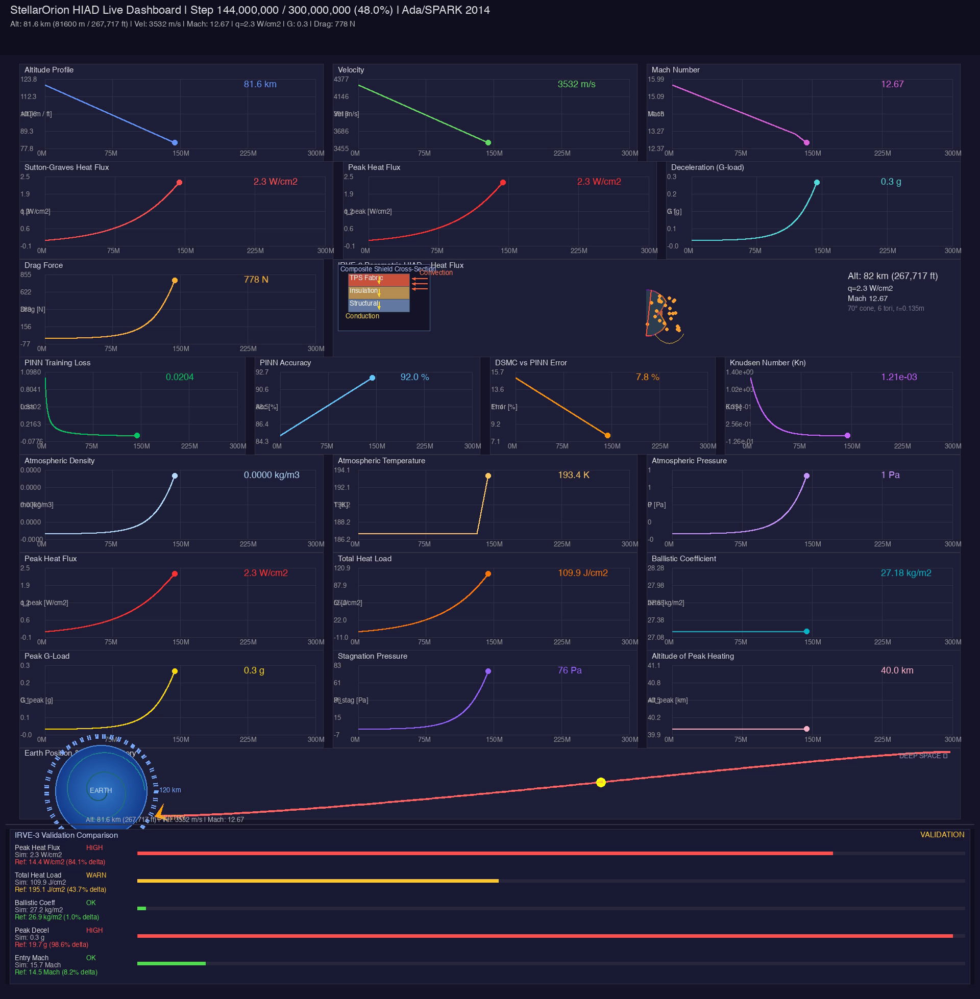
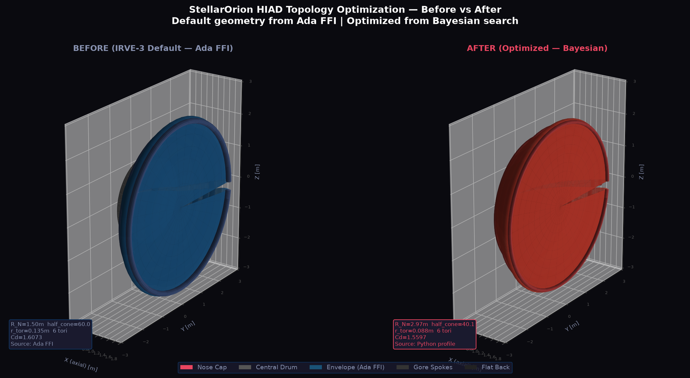

# StellarOrion HypersonicEdition

**Author:** Albert Starfield Wahyu Suryo Samudro

**Supervised by:**
1. Dr.-Ing. Mochammad Agoes Moelyadi, ST., MSc.
2. Yohanes Bimo Dwianto, S.T., M.T., Ph.D.

---

StellarOrion is a high-fidelity aerothermodynamic simulation and optimization suite for Hypersonic Inflatable Aerodynamic Decelerators (HIAD). It leverages the **SPARTA DSMC** solver for rarefied gas dynamics (Plimpton & Gallis, 2014) and a **Bayesian Optimization (GP Matern 5/2 + Expected Improvement)** stage for survivability optimization.

> **Note:** The legacy `main.py` entry point was deprecated on 2026-08-21 and has since been
> removed from the repository. All functionality now lives in the Ada/SPARK binary and the
> Python sidecar — use `python3 stellarorion_program_proc/run.py` instead.

## 🚀 Quick Start

```bash
cd stellarorion_program_proc
python3 run.py --self-test        # Run 18 verification tests
python3 run.py --test sample      # Run single SPARTA sample with 11-metric comparison
python3 run.py --help             # Show all CLI flags
```

## 🏗️ Architecture

This project uses a hybrid architecture for running simulations:

- **Ada/SPARK Binary:** Primary simulation engine (`stellarorion_program_proc/`). Compiled with Alire, formally verified with GNATprove (552 checks, 401 proved, 103 unproved in untouched analytics unit, 0 new failures; run 2026-09-25). Handles all 19 CLI modes including validation, optimization, calibration, and integration tests.
- **Docker:** Used exclusively for running the SPARTA DSMC simulation in a containerized Linux environment.
- **Python Sidecar:** Native OS Python environment for PINN refinement (DeepXDE), PyFluent/PyAnsys integration, and GUI launcher. Supports NVIDIA CUDA, AMD ROCm, Apple Metal (MPS), Intel OneAPI/OpenCL, and specialized accelerators.

---

## 📁 Source Layout (`stellarorion_program_proc/`)

Inventory as of 2026-09-23 (51 Ada units · ~35.4k Ada LOC · ~35.2k Python LOC under `src/`).

```text
stellarorion_program_proc/
├── run.py                 # Primary CLI entry (1,492 lines) — replaces deprecated main.py
├── alire.toml             # Alire crate (declares executable stellarorion_project; built binary: bin/main)
├── stellarorion_program_proc.gpr   # Main GPR → src/simulation_engine, Main: main.adb
├── stellarorion_pinn_lib.gpr        # PINN shared-library project
├── prove.sh / run_smooth.sh         # GNATprove + smooth-geometry runners
├── compare_validation.py            # Standalone validation comparison
├── postprocess_validation.py        # Post-process DSMC/validation outputs
│
├── src/
│   ├── simulation_engine/           # Ada/SPARK primary engine (25 packages + main.adb)
│   │   ├── main.adb                 # GPR main → dispatches into StellarOrion_Project
│   │   ├── stellarorion_project.*   # Entry + CLI surface (~1,900 lines: .adb+.ads)
│   │   ├── stellarorion_cli.*       # Has_Flag / Get_Option / Get_Float (SPARK On)
│   │   ├── stellarorion_self_test.* # 18 verification tests
│   │   ├── stellarorion_test_modes.*# --test sample|baseline|pinn|sparta|…
│   │   ├── stellarorion_sparta.*    # SPARTA DSMC driver (~4.5k lines body)
│   │   ├── stellarorion_physics.*   # Aerothermodynamics, Sutton-Graves, …
│   │   ├── stellarorion_geometry.*  # HIAD geometry / IRVE-3 baseline
│   │   ├── stellarorion_environment.* # ISA atmosphere, Mach/alt tables
│   │   ├── stellarorion_pinn_trajectory.* # Linear entry trajectory
│   │   ├── stellarorion_trajectory_output.* # T1: H(0)=120 km, H(300M)=40 km
│   │   ├── stellarorion_ffi.*       # C ABI for Python ctypes sidecar
│   │   ├── stellarorion_optimization.* / stellarorion_optimize.*  # BO/GA hooks
│   │   └── validation, postprocessing, reports, status_writer, types,
│   │       history, pipeline_checkpoint, dual_watchdog, runtime_guard, …
│   │
│   ├── python/                      # Python sidecar (20 modules)
│   │   ├── validation_pipeline.py   # Unified comparison + convergence audit
│   │   ├── ada_pinn_wrapper.py      # ctypes FFI → libstellarorion_pinn
│   │   ├── hiad_optimizer.py        # Bayesian optimization driver
│   │   ├── generate_outputs.py      # Dashboard MP4 / overlay panels
│   │   └── kriging_denoise, pinn_*, pipeline_*, sidecar_*, …
│   │
│   ├── ui/                          # sidecar_ui.py + frontend/ + uiassets/ (TS)
│   ├── sidecar_ui/                  # Standalone sidecar HTML/JS shell
│   ├── utils/                       # sabotage_verifier.py, add_exception_handlers.py
│   ├── proofs/  rocq/               # Coq proof skeletons per unit
│   └── …
│
├── scripts/                         # Plot/report generators + prove.sh + SabotageVerifier.sh
├── tests/                           # test_main.adb (Ada harness) + test_run_pipeline.py
├── tools/                           # plot_surf_profile.py
├── config/                          # Generated config .ads/.gpr/.h
├── docs/                            # AXIOMS, APPLICATIONS, CITATIONS, PROJECT_DECOMPOSITION_PLAN, …
├── data/  results/                  # Run status JSON, validation plots/VTU/CSV
├── alire/  bin/  obj/  lib/         # Alire deps + build artifacts
└── proofs/                          # Coq/Rocq proof skeletons (GNATprove artifacts: obj/gnatprove/)
```

**Entry path:** `python3 run.py` → compiled binary `bin/main` (`run.py` `_find_binary()`; GPR `Main: main.adb` in `src/simulation_engine/`). Note: `alire.toml` declares the crate executable as `stellarorion_project`, but the built/launched binary is `bin/main`.

---

## 🎬 Live Dashboard Animation

Real-time aerothermodynamic visualization of the IRVE-3 HIAD reentry — featuring Sutton-Graves heat flux, PINN training metrics, composite material cross-section with heat propagation, and animated Earth trajectory.



**Full animation:** [hybrid_dsmc_pinn_animation.mp4](stellarorion_program_proc/results/validation_scalloped/plots/hybrid_dsmc_pinn_animation.mp4) (111s, 30fps, 87 MB)

The video has four segments: a 2s title card, the main live dashboard (~100s, curves grow frame-by-frame), then three 3s focus segments — **Trajectory** (altitude / velocity / Mach), **Thermal** (Sutton-Graves heat flux / Mach), and **Mechanical** (drag / G-load / Mach). Pass `--validation` when regenerating to overlay the 5-metric IRVE-3 comparison panel (Peak Heat Flux, Total Heat Load, Ballistic Coeff, Peak Decel, Entry Mach), or `--optimized-topology` to overlay the Bayesian-optimization before/after comparison panel (nose radius, torus radius, half-cone angle, C<sub>d</sub> reduction).

**Dashboard panels:**
- Row 1: Altitude / Velocity / Mach Number
- Row 2: Sutton-Graves Heat Flux / Peak Heat Flux / Deceleration (G-load)
- Row 3: Drag Force / IRVE-3 Vehicle (with composite material inset & heat propagation)
- Row 4: PINN Training Loss / PINN Accuracy / DSMC vs PINN Error / Knudsen Number
- Row 5: Atmospheric Density / Temperature / Pressure
- Row 6: Peak Heat Flux / Total Heat Load / Ballistic Coefficient
- Row 7: Peak G-Load / Stagnation Pressure / Altitude of Peak Heating
- Row 8: Earth Position & Flight Trajectory (animated spiral Earth, orange arrowhead)

```bash
# Regenerate animation
cd stellarorion_program_proc/src/python
python3 generate_outputs.py --mp4-only

# Cap dashboard frames for fast iteration (e.g. 300 frames ≈ 10s of dashboard)
python3 generate_outputs.py --mp4-only --max-frames 300

# Include the IRVE-3 validation overlay panel (dedicated bottom strip)
#   → stellarorion_program_proc/results/validation_scalloped/plots/hybrid_dsmc_pinn_animation_validation.mp4
python3 generate_outputs.py --mp4-only --validation

# Include the optimized-topology before/after overlay panel (dedicated bottom strip)
#   → stellarorion_program_proc/results/OptimizedTopology/plots/hybrid_dsmc_pinn_animation_optimized.mp4
python3 generate_outputs.py --mp4-only --optimized-topology
```

---

## 🛠️ Requirements & Installation

- **Docker:** Required for SPARTA simulation.
- **Python 3.10+**: Recommended (for build pipeline and PINN sidecar).
- **Ada/Alire:** Required for the primary simulation binary.
- **Dependencies:** Auto-installed by `run.py` (hash-gated venv).

```bash
cd stellarorion_program_proc
python3 run.py --help          # Show all CLI flags
python3 run.py --self-test     # Run 18 verification tests
```

---

## 🧮 Theory & Derivation

For all mathematical models (DSMC rarefied gas dynamics, aerothermodynamics, Sutton-Graves, radiative equilibrium, 1D thermal model, optimization cost functions, PINN Navier-Stokes), see **[DERIVATION.md](DERIVATION.md)**.

---

## 📊 Grid Independency & Optimization
To ensure the simulation accuracy balances computational cost, a **Grid Independency Test** was performed. The `grid-factor` (mesh density multiplier) was evaluated against reference data from the **IRVE-3 MDAO (Multidisciplinary Design Analysis and Optimization)** paper.

*   **Test Range:** 0.3 to 1.0
*   **Optimal Result:** `0.7`
*   **Rationale:** At a factor of `0.7`, the simulation yields the least error compared to validated flight data and high-fidelity reference cases, while maintaining efficient execution times. Consequently, **0.7 is now the default grid factor** for all simulation runs.

Users can manually override this via:
```bash
cd stellarorion_program_proc && python3 run.py --grid-factor 1.0 --test sample
```

## 🎯 Optimized Topology: Before vs After

Bayesian Optimization (GP Matérn 5/2 kernel + Expected Improvement acquisition, 70 evaluations) was applied to the IRVE-3 HIAD geometry under the **multi-objective cost J(x)** — a validation-referenced scalarisation whose **primary objective is the lowest Total Heat Load** (terms: Total Heat Load, peak heat flux, ballistic-coefficient deviation, C<sub>d</sub>; quadratic penalties: 3 m envelope, 1.0 m TPS nose, and the **payload-size constraint** R<sub>N</sub> ≥ √(r²+(h/2)²)+0.15 ≈ 1.043 m for the 0.275 m × 1.7 m payload). All reference values (Q<sub>target</sub>, q<sub>ref</sub>, τ, C<sub>d,ref</sub>) are loaded **dynamically at run time** from `unified_comparison_data.json` (see `DERIVATION.md` §4). Result (official run 2026-09-26, stored in `stellarorion_program_proc/src/python/hiad_optimization_results.json`): **25.78 % lower J and 28.95 % lower Total Heat Load — 155.67 J/cm², 6.06 % below the 165.72 J/cm² validation target**, with zero constraint violations.



**Before/After Parameters:**

| Parameter | Default (IRVE-3 Baseline) | Optimized | Δ |
| :--- | :--- | :--- | :--- |
| **Nose Radius (R<sub>N</sub>)** | 1.5000 m | 2.9714 m | +98.10% |
| **Torus Radius (r<sub>tor</sub>)** | 0.1350 m | 0.0885 m | −34.47% |
| **Half-Cone Angle** | 60.00° | 40.15° | −33.09% |
| **Drag Coefficient (C<sub>d</sub>)** | 1.6073 | 1.5597 | −2.96% |
| **Sutton-Graves Heat Flux** | 16.14 W/cm² | 11.47 W/cm² | −28.95% |
| **Total Heat Load Q(x)** | 219.10 J/cm² | **155.67 J/cm²** (target 165.72) | **−28.95%** |
| **Cost J(x)** | 2.1626 | 1.6051 | −25.78% |

*The larger nose radius is the heat-load optimum: Sutton–Graves flux scales as 1/√R<sub>N</sub>, and J(x) prices that directly against the drag and ballistic-coefficient terms.*

*This table is the **round-1** BO winner — exactly what the three figures above render. After the hybrid gate's multi-fidelity correction (below), the **round-2** re-optimization converged to 2.998 m / 0.053 m / 42.29° with corrected J(x) = 1.1415.*

**Optimization method:** CCD 15-point initial sampling (best: J = 1.996 at factorial+--), then 20-point LHD + 50-point Bayesian Optimization (70 total evaluations) with a GP Matérn 5/2 surrogate model and Expected Improvement acquisition function. Full details in `stellarorion_program_proc/Optimization_Attempt_1.md`.

**Generated figures:** `stellarorion_program_proc/optimization_comparison.png` (before/after profiles),
`stellarorion_program_proc/bo_optimization_3d.png` (3D scatter + GP slices + convergence),
`stellarorion_program_proc/hiad_geometry_grid.png` (87-panel grid variation: default + 15 CCD + 70 BO history + optimum).

**Grid variation of the design space** — every geometry the optimizer evaluated (top-left default, 15 CCD samples, 70 BO proposals, top-right optimum):


```bash
# Regenerate comparison images
cd stellarorion_program_proc/scripts
python3 render_optimization_comparison.py
python3 render_bo_3d_plot.py
python3 render_geometry_grid.py
```

### 🔒 Hybrid Validation Gate: enforced DSMC+PINN re-simulation of the winner

The analytic optimum above is only trusted after the **high-fidelity chain
re-simulates it**. `hiad_optimizer.py --hybrid-validate` enforces this as a
post-optimization gate (plan Parts B/C):

1. **Preconditions** (binary, Docker, validation venv, pipeline, reference CSV)
   and a seconds-fast **geometry QA** (`bin/main --validate-only`) run before
   any long simulation; every failure is reported with path + fix (exit 1).
2. **DSMC leg** re-simulates the BO winner: `bin/main --validate --headless
   --nose … --tradius … --angle … --skin scalloped --steps 2200
   --results-dir results/validation_optimized` (2–3 h, 4 h timeout, output
   streamed to `gate_r1_dsmc.log`). The `--results-dir` flag is honored since
   the 2026-09-25 Ada CLI fix, so reference data in `results/validation_scalloped/`
   is never overwritten (SHA-256 verified before/after).
3. **PINN leg** runs `validation_pipeline.py` on the fresh CSV and writes a
   new `unified_comparison_data.json` under the gate directory.
4. **Verdict**: `PASS ⇔ q_hybrid ≤ Q_target (165.716 J/cm²)` with the
   prediction error `(q_hybrid − q_analytic)/q_analytic`; stored as
   `hybrid_validation.verdict` in `hiad_optimization_results.json`.
5. **Multi-fidelity correction** (Kennedy & O'Hagan 2000): bounded factor
   `c = clamp(q_hybrid/q_analytic, 0.5, 2.0)` is applied to J(x)'s heat-load
   term and the optimizer re-runs (**round 2**, stored as `optimized_round2`).

**Official gate result (2026-09-26): PASS** — validated geometry
R_N = 2.971 m, r_tor = 0.088 m, half_cone = 40.15°: hybrid Q = **77.93 J/cm²**
≤ target 165.72 (analytic predicted 155.67, error −49.94 %, correction
c = 0.5006 at the clamp floor); round-2 optimum 2.998 / 0.053 / 42.29°.
Two independent DSMC runs agreed within 0.3 %, so the analytic-vs-hybrid gap
is reproducible signal — exactly what the correction loop absorbs. The gate
also proved its fail-loud contract first: an initially missing pipeline
artifact caused an exit-1 abort with a full error block instead of a
fabricated verdict (root cause: `usetex` rejecting `⚠` in a plot caption,
fixed in `validation_pipeline.py`).

```bash
cd stellarorion_program_proc
python3 src/python/hiad_optimizer.py --hybrid-validate --dry-run   # preconditions+QA only
python3 src/python/hiad_optimizer.py --hybrid-validate             # full gate (2–3 h+)
python3 src/python/hiad_optimizer.py --hybrid-validate --allow-fail # keep exit 0 on FAIL
```

Exit codes: `0` success/PASS/dry-run/`--allow-fail` · `1` infrastructure
failure (never a fabricated verdict) · `3` verdict FAIL. All gate artifacts
stay in `results/validation_optimized/` (a pre-existing non-empty directory is
refused unless `--force` is given). Full details: `stellarorion_program_proc/Optimization_Attempt_1.md`,
section *Hybrid Validation Gate (Attempt 3)*.

## 🛰️ HIAD Validation: Unified Comparison (IRVE-3 vs LOFTID vs Models vs StellarOrion)

StellarOrion is validated against **IRVE-3 flight data** (NASA TP-2013-4012) and **LOFTID flight data** (Deshmukh et al. AIAA 2024-1501, Hollis et al. AIAA 2024-1498), alongside analytical/CFD models (Sutton-Graves, Fay-Riddell). All sources are compared side-by-side below.

### Combined Validation Table

| Parameter | IRVE-3 Flight | LOFTID Flight | Rapisarda Models | StellarOrion DSMC | Source |
| :--- | :--- | :--- | :--- | :--- | :--- |
| **Aeroshell Diameter** | 3.0 m | 6.0 m | — | — | NASA TP-2013-4012; Deshmukh AIAA 2024-1501 |
| **Peak Heat Flux ($\dot{q}$)** | **14.36 W/cm²** | **39.27 W/cm²** | 13.83 W/cm² (FR) / 15.26 W/cm² (SG) | **12.2 W/cm² (DSMC+SG)** | Rapisarda Table 4.10; Deshmukh AIAA 2024-1501; StellarOrion |
| **Total Heat Load ($Q$)** | **195.06 J/cm²** | **3,520 J/cm²** | 195.17 J/cm² (FR) / 223.95 J/cm² (SG) | **165.72 J/cm²** | Rapisarda Table 4.10; Deshmukh AIAA 2024-1501; StellarOrion |
| **Ballistic Coeff ($\beta$)** | 26.9 kg/m² | ~22.6 kg/m² (est.) | — | **27.70 kg/m²** | NASA TP-2013-4012; Discussion.md; StellarOrion |
| **Peak Deceleration** | **19.7 g** | **9.66 g** | — | **16.83 g** | NASA TP-2013-4012; Deshmukh AIAA 2024-1501; StellarOrion |
| **C_d** | — | — | — | **1.4625** | StellarOrion (within LOFTID range 1.4–1.7) |
| **C_l** | — | — | — | **−0.5560** | StellarOrion (VALIDATION_Sep_2_2026.md §3.1; negative = downward lift) |
| **L/D** | — | — | — | **0.3802** | StellarOrion |
| **Peak Drag** | — | — | — | **45,410 N** | StellarOrion (VALIDATION_Sep_2_2026.md §3.1, step 2200) |
| **Peak \|Lift\|** | — | — | — | **17,263 N** | StellarOrion (VALIDATION_Sep_2_2026.md §3.1, step 2200, magnitude) |
| **Drag_avg** | — | — | — | **597.5 N** | StellarOrion (VALIDATION_Sep_2_2026.md §3.1, per-element average) |
| **Lift_avg** | — | — | — | **−227.1 N** | StellarOrion (VALIDATION_Sep_2_2026.md §3.1, per-element average) |
| **Entry Velocity** | ~3.5–4.5 km/s | >8.0 km/s | — | — | Discussion.md (Sutton-Graves V³ scaling) |

**Column key:**
- **IRVE-3 Flight** — NASA TP-2013-4012 (suborbital, Wallops Island, Black Brant XI)
- **LOFTID Flight** — Deshmukh et al. AIAA 2024-1501 / Hollis et al. AIAA 2024-1498 (LEO, 6 m, >8 km/s)
- **Rapisarda Models** — Rapisarda (2023, MSc Thesis, TU Delft) Table 4.10: Fay-Riddell (FR) CFD and Sutton-Graves (SG) correlation applied to IRVE-3 trajectory
- **StellarOrion DSMC** — Our SPARTA DSMC simulation (Sep 2, 2026, scalloped geometry, step 2200, 6 MPI ranks)

### Simulation Environment Conditions

Each source uses different atmosphere models, geometry, and solvers — this directly affects comparability.

| Condition | IRVE-3 Flight | LOFTID Flight | Rapisarda Models | StellarOrion DSMC |
| :--- | :--- | :--- | :--- | :--- |
| **Atmosphere Model** | Actual atmosphere | Actual atmosphere | MCD v6.1 (~56% higher density than ISA at 52 km) | ISA |
| **Gas Composition** | Real air | Real air | Earth air (MCD v6.1 for density/temp profiles only) | Five_Species: N₂, O₂, NO, N, O |
| **Geometry** | IRVE-3 inflatable (3.0 m) | LOFTID inflatable (6.0 m, 70° sphere-cone, 6+1 tori) | Smooth toroid ($r_{torus}$ = 0.135 m) | **Scalloped** (grooved-torus), 3.0 m |
| **Solver Method** | Flight instrumentation | Flight instrumentation | Fay-Riddell CFD / SG correlation | SPARTA DSMC (VSS, grid 0.7) |
| **Trajectory** | Full reentry (Black Brant XI, suborbital) | Full reentry (LEO, >8 km/s) | Full trajectory integration | **Single point** (step 2200): h = 51.82 km, Mach 10.29, V = 3,379 m/s |
| **Noise Filtering** | Hardware averaging | Hardware averaging | 6th-order polynomial + Wilmoth | Raw per-element `f_1[3]` |

**Why this matters:** The −15% delta in heat load and g-load is expected — StellarOrion runs a single trajectory point while flight data and Rapisarda's models integrate over the full trajectory. The density difference between MCD v6.1 and ISA (56% at 52 km) explains part of the gap between our single-point SG (12.2 W/cm²) and Rapisarda's trajectory-integrated SG (15.26 W/cm²), since $\dot{q}_{SG} \propto \sqrt{\rho}$.

**Notes on peak heat flux (DSMC+SG):** StellarOrion reports $\dot{q}$ as the **processed Sutton-Graves (SG)** correlation value from the DSMC run conditions — **12.2 W/cm²** at the single-point condition — not as a direct DSMC peak. Raw DSMC single-cell samples (182.5 W/cm²) are statistical noise and are not the headline metric; the per-element DSMC average (56.6 W/cm²) is kept only in the validation deep-dive. This is the same processed SG quantity Rapisarda reports as 15.26 W/cm² (trajectory-integrated). See DSMC Noise Methodology section below.

**Delta analysis:**
- **Heat load:** StellarOrion (165.72 J/cm²) is −15% vs flight (195.06) — single trajectory point vs full integrated trajectory
- **G-load:** StellarOrion (16.83 g) is −15% vs flight (19.7 g) — same single-point vs trajectory explanation
- **Ballistic coeff:** StellarOrion (27.70 kg/m²) is +3% vs flight (26.9) — confirms geometry fidelity of the scalloped model

**Plots generated:** 52 PNGs total (21 CSV time-series + 6 derived thermal + 24 VTU visualizations + dashboard frame).

See `stellarorion_program_proc/results/validation_scalloped/VALIDATION_Sep_2_2026.md` for full results.

Users can run the automated calibration suite using:
```bash
cd stellarorion_program_proc && python3 run.py --compareCalibrate --solver sparta --steps 1000
```

### IRVE-3 Rapisarda Testing Variant: Mars Chemistry Mode

StellarOrion supports a `--chemistry mars` mode using a CO2-dominated atmosphere model (`mars.vss`, `mars.react`). This is relevant because Rapisarda (2023) used the **Mars Climate Database v6.1 (MCD v6.1)** as a cross-validation technique — applying Mars-derived atmosphere data to Earth re-entry validation.

**Key distinction (from source code comments in `stellarorion_sparta.adb` ~line 3056):**
- IRVE-3 is an **Earth re-entry** mission (Wallops Island VA, Black Brant XI)
- Our code uses ISA (International Standard Atmosphere) — correct for Earth
- Rapisarda's MCD v6.1 gives ~56% higher density than ISA at 52 km
- Since SG ∝ √ρ, this density ratio (1.564) produces a 25% higher SG heat flux
- This explains part of the gap between our single-point SG (12.2 W/cm²) and Rapisarda's trajectory-integrated SG (15.26 W/cm²)

**Usage:**
```bash
cd stellarorion_program_proc && python3 run.py --chemistry mars --test sample --steps 1000
```

## 🔬 DSMC Noise Methodology: Raw DSMC vs Post-Processed DSMC

Both StellarOrion and Rapisarda (2023) use DSMC — it is the standard method for rarefied gas dynamics (Bird, 1994). The difference is in how the raw DSMC output is processed:

Rapisarda (2023, MSc Thesis, Delft University of Technology) used Moss et al. (2006) stagnation-point DSMC data and applied three layers of noise filtering:

1. **Pre-processed data** — Moss's published values were already time-averaged over many particle timesteps
2. **6th-order polynomial fit** — Smoothed residual scatter and extrapolated into the free-molecular flow regime (R²→1) (Sec 4.5.1, Fig 4.40, Table 4.13)
3. **Wilmoth bridging function** — Fitted to polynomial-smoothed data via non-linear least-squares (R²=0.99138 per thesis text; Table 4.15 reports R²=0.9792 for the specific coefficient fit) (Sec 4.4.5, Fig 4.41, Table 4.15)

**Contrast with our approach:** Both StellarOrion and Rapisarda use DSMC — it is the standard method for rarefied hypersonic flow (Bird, 1994). The difference is post-processing. We read raw per-element `f_1[3]` (kinetic energy flux, W/m²) from SPARTA surf dumps and apply no smoothing. The max-cell value is a single noisy point-sample. Negative values at later steps (e.g., −10,570 W/m² at step 2200) are DSMC statistical noise — inherent to any raw DSMC output. Rapisarda's 3-layer filtering (polynomial fit + Wilmoth bridging) removes this noise at the cost of introducing model-dependent smoothing. Three code comment blocks in `stellarorion_sparta.adb` (~lines 772, ~1999, ~3127) document this noise context and cite Rapisarda's methodology.

See `stellarorion_program_proc/results/validation_scalloped/VALIDATION_Sep_2_2026.md` Section 9 for full comparison.

## 📝 Code Updates (Ada/SPARK)

### Ada Fixes Applied

| Fix | File | Description |
| :--- | :--- | :--- |
| **Sin_Rad/Cos_Rad range reduction** | `stellarorion_geometry.adb` | Fold large arguments into [-π, π] for Taylor series accuracy |
| **Run_SPARTA surf copy path** | `stellarorion_sparta.adb` | Read surf file from `Results_Dir`, not hardcoded repo root |
| **Parse_Surf_Geometry state exit** | `stellarorion_sparta.adb` | Exit State=1 when "Lines" keyword detected, preventing Curve corruption |
| **Heat_Flux_Avg dimensional correction** | `stellarorion_sparta.adb` | Changed from `Heat_Sum / Surf_Area` (W/m⁴) to `Heat_Sum / Float(N)` (W/m²) |
| **VTU connectivity spacing** | `stellarorion_sparta.adb` | Fixed missing space after N3 in quad connectivity (VTK XML parse error) |

### DSMC Noise Documentation (Code Comments)

Three comment blocks added to `stellarorion_sparta.adb` documenting:

1. **~line 772**: DSMC noise context near surf compute/fix commands — why SPARTA "reduce max" on `f_1[3]` produces noise, Rapisarda's 3-layer strategy, future work options
2. **~line 1999**: Per-element heat flux parsing at `Heat(Row) := V(4)` (line 1999) — noise source, negative values, Rapisarda's polynomial smoothing
3. **~line 3127**: Per-element average vs Rapisarda's polynomial at `Avg_Heat_Flux := Heat_Sum / Float(N)` (line 3127) — 3 types of data (flight area-weighted, Rapisarda polynomial-smoothed, our raw per-element)

### GNATprove Level 4 Validation

- Latest full run (2026-09-25, `alr exec -- gnatprove -P stellarorion_program_proc.gpr --level=4 -j0 --report=all`): **552 checks total — 401 proved by prover (73%), 103 unproved (19%), 48 flow-analysis checks (initialization + termination, all pass)**, exit code 0. Includes the `--results-dir` honoring fix in `stellarorion_project.adb` (its new obligations all proved; unproved count unchanged at 103)
- All 103 unproved checks are concentrated in `stellarorion_postprocessing` (floating-point overflow / array-index checks in analytics code) — a unit **not modified** in this change-set; its check count grew with that unit's own Sep 13–14 commits
- **0 new failures introduced by code changes**: the new physics units are SPARK_Mode Off bodies (package-wide exception-handler convention) contributing 0 analyzed checks; the self-test unit is likewise fully skipped
- Historical baseline (2026-09-03, before the Sep 9–10 VERBOSE_ERROR handler campaign moved many bodies to SPARK_Mode Off): 889 checks, 666 proved (75%), 35 justified, 54 unproved, 134 flow checks
- Fixed 2026-09-25: removed the `-gnatdA` debug switch from all three GPRs — it forced conflicting duplicate entries into GNATprove's data-representation JSON, which gnat2why rejected ("ill-formed JSON file") and used to abort every proof run; root cause + minimal repro documented in `stellarorion_program_proc/docs/APPLICATIONS.md` (AP-9)

## 📄 Documentation

| Document | Path | Content |
| :--- | :--- | :--- |
| **Discussion** | `stellarorion_program_proc/Discussion.md` | 12 numbered sections (1–10, 12–13) + Appendix: vehicle comparison, IRVE-3/LOFTID data, DSMC results, delta comparison, SG vs FR analysis, physics verification, optimization chain |
| **Validation** | `stellarorion_program_proc/results/validation_scalloped/VALIDATION_Sep_2_2026.md` | 11 numbered sections (1–11) + References: simulation config, convergence, results, comparison, heat flux investigation, 52 plots, survivability, code fixes, DSMC noise methodology, storage paths, open items |

### Discussion.md Sections (12 + Appendix)

1. Executive Summary
2. Vehicle Comparison (Rapisarda Table 4.1)
3. IRVE-3 Validation Data (Rapisarda Table 4.10, NASA TP-2013-4012)
4. LOFTID Flight Data (Deshmukh AIAA 2024-1501, Hollis AIAA 2024-1498)
5. StellarOrion DSMC Validation Results — includes:
   - 5.4 Delta Comparison: StellarOrion vs Rapisarda IRVE-3 vs Flight
   - 5.5 Sutton-Graves vs Fay-Riddell: When Each Is Good, When Each Fails
   - 5.6 Mathematical Derivation: Why Our DSMC, Fay-Riddell, and Sutton-Graves Give Different Answers
6. Cross-Mission Comparison Table
7. Rapisarda Model Performance Across Missions
8. StellarOrion Physics Verification (GNATprove)
9. Key Findings and Next Steps
10. IRVE-3 Rapisarda Baseline → Earth Reentry Optimization Chain
12. Key Success Variables: What Determines Mission Success?
13. References
- Appendix A: Raw StellarOrion DSMC Data

## 📦 Split Archive Files

Large weekly report archives (>50 MB) are split into 25 MB chunks for GitHub compliance:

```bash
# Reassemble split archives locally
cd Lost+Found/ProgressReport && bash reassemble.sh
```

Original `.tar.zst` files are excluded from git tracking (see `.gitignore`). Split parts are tracked.

## 📚 References
For detailed scientific citations and mission parameters (IRVE-3, LOFTID), see [REFERENCES.MD](REFERENCES.MD).
